  
  
  

  

# 🚆 RailGuard Command Center

### AI-Powered Real-Time Railway Sabotage Detection System

  

    <a href="#-problem-statement">Problem</a> •
    <a href="#-system-architecture">Architecture</a> •
    <a href="#-tech-stack">Tech Stack</a> •
    <a href="#-installation--setup">Setup</a> •
    <a href="#-how-to-run">Run</a>
  

  
  
  
  
  

---

## 🚀 Problem Statement

Railway safety is critical, yet infrastructure is often compromised by sabotage, theft, or tampering. Traditional inspection methods are reactive and intermittent. **RailGuard** provides a **proactive** solution to:

- 🔍 **Detect** physical tampering (sawing, hammering, removal) in real-time.
- 🧠 **Analyze** multi-sensor data using Edge AI and Cloud AI.
- 🚨 **Alert** operators instantly via a geospatial dashboard.

---

## 🔄 System Architecture

The system follows a linear data pipeline from the physical edge to the operator dashboard.

```mermaid
graph LR
    A[ESP32 Node 📡] -->|MQTT| B(HiveMQ Broker ☁️)
    B -->|Subscribe| C{Node.js Backend ⚙️}
    C -->|HTTP Post| D[Python AI Service 🧠]
    D -->|Prediction| C
    C -->|Socket.io| E[React Dashboard 🖥️]
```

